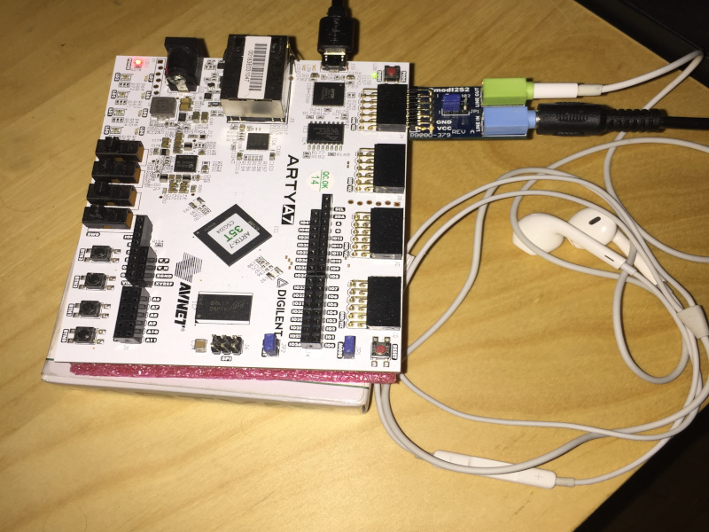

I2S driver demo running in Zephyr
==================

I2S sound driver allows endpoint applications to receive and transmit audio PCM frames.

We can distinguish two main parts of the sound system.
 - The I2S core written completely in Migen, which can be connected to the LiteX SoC.
   It enables I2S hardware support for sound transmission.
 - The I2S Zephyr driver that allows collecting and transmitting sound samples using the 
   real-time operating system.

Devices
-----------------

To use the driver you need an FPGA board that is supported by the LiteX SoC build system and the I2S codec.
The driver was tested with:
 - [Arty-7 board](https://reference.digilentinc.com/reference/programmable-logic/arty-a7/reference-manual) 
 - [Pmod-i2s2](https://reference.digilentinc.com/reference/pmod/pmodi2s2/reference-manual)

The following instructions pertain to a setup consisting of those devices.

Device configuration
-----------------

The I2S2 Pmod can be connected to any Pmod connector on the Arty-7 board.  
By default, LiteX is configured to support Pmod on `JA` connector.  
The PMOD I2S2 jumper has to switch the device into master mode. To do so, put the jumper in the `MST` position.   
This allows the device to generate required signals using its internal circuits. 

Example setup
-----------------

   

Prerequisites
-----------------

### Building the gateware
Install the Vivado toolchain. You can download it from the official Xilinx site.  
Install the RISC-V toolchain. Add the toolchain to your system path.  
Clone the repository and submodules:
```bash
git clone https://github.com/antmicro/zephyr-on-litex-vexriscv
cd zephyr-on-litex-vexriscv
git submodule update --init --recursive
source ./init
source ${PATH_TO_VIVADO_TOOLCHAIN}/settings64.sh
./make.py --board=arty --build --with_mmcm --with_i2s --with_ethernet
```

### Building the Zephyr 
Follow this [tutorial](https://github.com/antmicro/zephyr-on-litex-vexriscv-build) to set up the Zephyr for LiteX and then
build the [I2S Zephyr example](https://github.com/zephyrproject-rtos/zephyr/tree/master/samples/drivers/i2s/litex)
